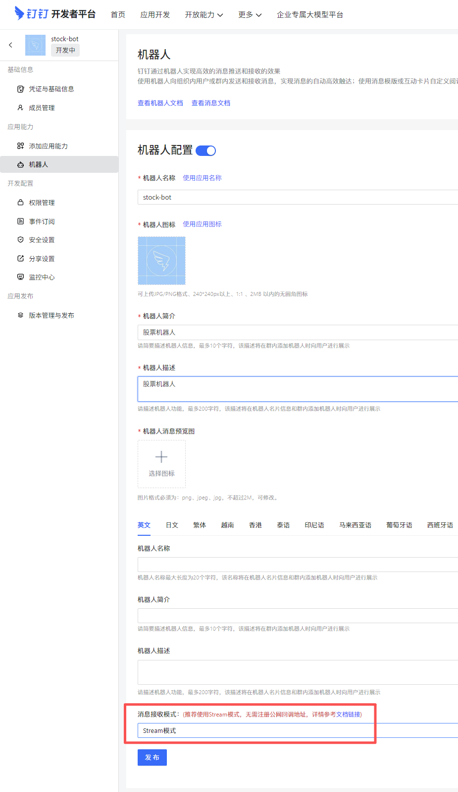
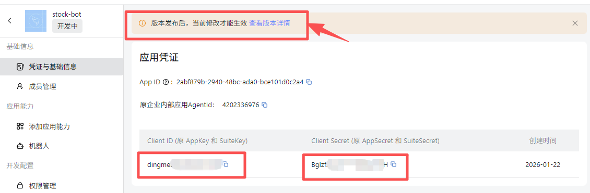
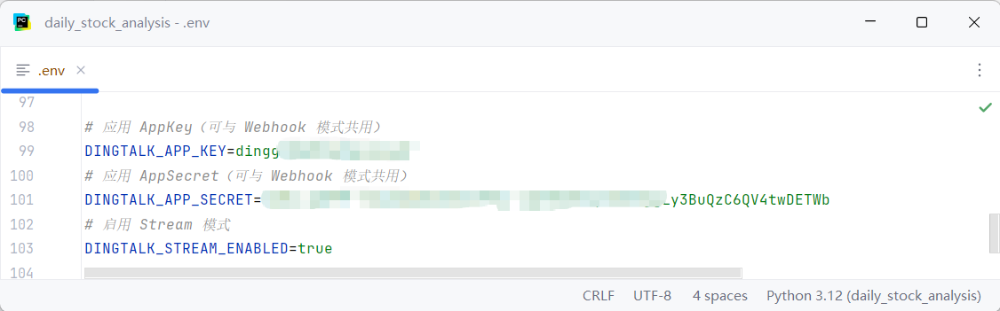
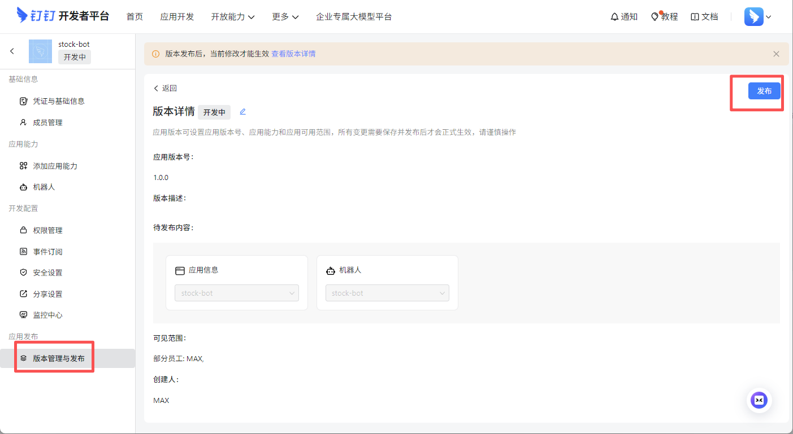
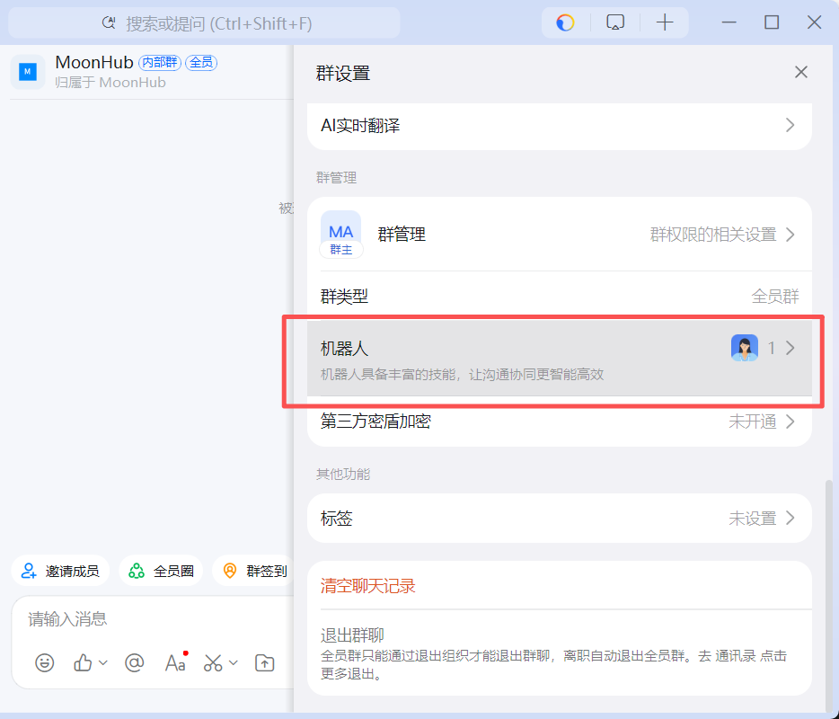
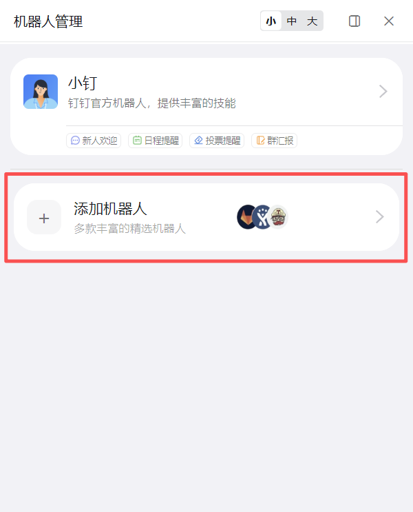
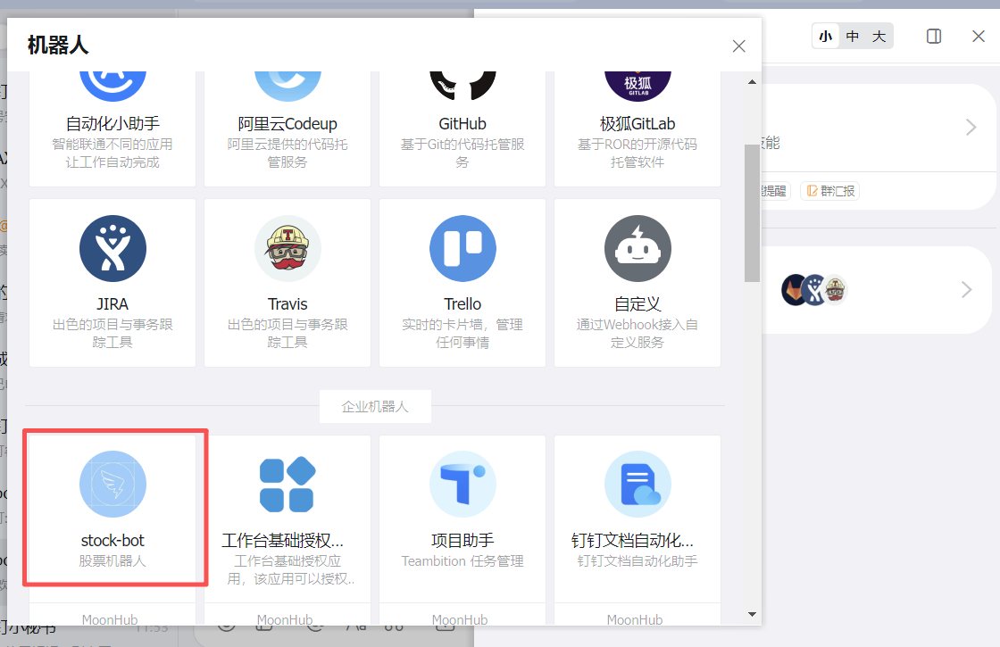
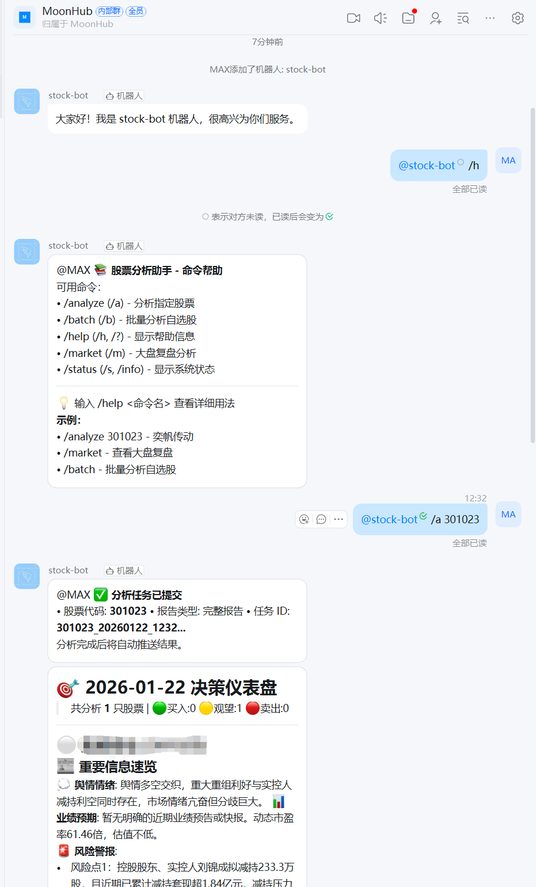

# 钉钉企业机器人配置

## 钉钉机器人
钉钉机器人接收消息需要使用企业机器人能力
https://open.dingtalk.com/document/dingstart/configure-the-robot-application

接收消息分为 `Http模式`（需要配置公网地址） 和 `Stream模式` 两种, 推荐使用 `Stream模式`

创建应用步骤：https://open.dingtalk.com/document/dingstart/create-application

应用开发 > 企业内部应用 > 钉钉应用 > 创建应用 > 添加应用能力 > 机器人

### 添加机器人

### 配置机器人使用 Stream模式

### 获取应用凭证

### 配置钉钉凭证
把钉钉应用凭证配置到配置文件中

### 发布应用

### 往下滚动会看到增加的企业机器人

### 测试机器人命令
