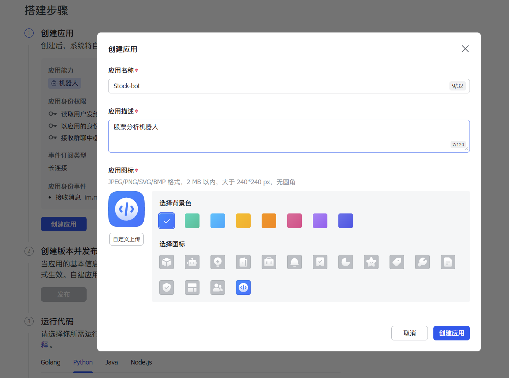
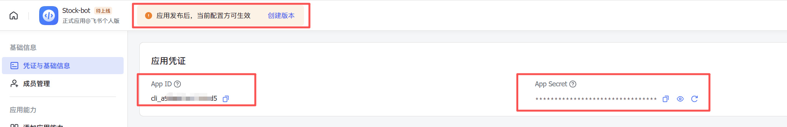
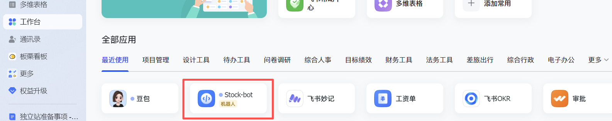
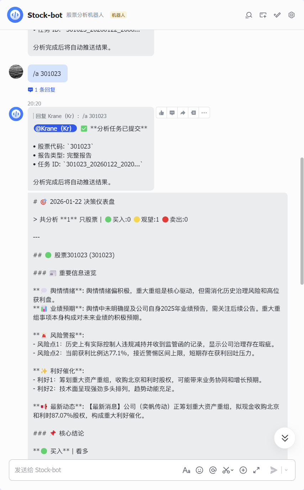

# 飞书通知配置指南

本文只解决两类常见诉求：

1. 把分析结果推送到飞书群
2. 避免把飞书应用模式和群机器人 Webhook 模式混用

## 先分清两种模式

### 模式一：群机器人 Webhook 推送

适用场景：
- 你只想把分析报告推送到飞书群
- 不需要处理飞书消息回调
- 不需要 Stream Bot

这也是本项目最推荐、最容易落地的飞书通知方式。

需要配置的变量：

```env
FEISHU_WEBHOOK_URL=https://open.feishu.cn/open-apis/bot/v2/hook/your_hook_token
# 按需填写
FEISHU_WEBHOOK_SECRET=your_sign_secret
FEISHU_WEBHOOK_KEYWORD=股票日报
```

### 模式二：飞书应用 / Stream Bot / 云文档

适用场景：
- 你要做飞书应用机器人交互
- 你要启用 Stream 模式
- 你要用飞书云文档能力

相关变量：

```env
FEISHU_APP_ID=cli_xxx
FEISHU_APP_SECRET=xxx
FEISHU_STREAM_ENABLED=true
```

注意：
- `FEISHU_APP_ID` / `FEISHU_APP_SECRET` 不会直接开启群 Webhook 推送
- 只想收通知时，不要只填 App ID / Secret，必须优先配置 `FEISHU_WEBHOOK_URL`
- 如果你做的是应用机器人 / Stream Bot，可直接看文末保留的原流程截图参考

## Webhook 推送的正确配置步骤

### 1. 在飞书群里创建自定义机器人

路径通常是：
- 群聊
- 群设置
- 群机器人
- 添加机器人
- 自定义机器人

完成后复制机器人提供的 Webhook URL。

示例：

```env
FEISHU_WEBHOOK_URL=https://open.feishu.cn/open-apis/bot/v2/hook/xxxxxxxx-xxxx-xxxx-xxxx-xxxxxxxxxxxx
```

### 2. 查看机器人安全设置

飞书群机器人常见有三种安全限制：

1. 不加任何安全设置
2. 开启“关键词”
3. 开启“签名校验”

如果你的机器人开启了额外安全项，项目侧也必须同步配置，否则请求会被飞书拒绝。

#### 开启了关键词

把飞书里配置的同一个关键词写到：

```env
FEISHU_WEBHOOK_KEYWORD=股票日报
```

项目会自动在每条飞书消息前补上这个关键词，你不需要手工改报告模板。

#### 开启了签名校验

把飞书里显示的 secret 写到：

```env
FEISHU_WEBHOOK_SECRET=your_sign_secret
```

项目会自动按飞书要求为每条消息补 `timestamp` 和 `sign`。

### 3. 启动并验证

只要配置了 `FEISHU_WEBHOOK_URL`，通知发送就会走 Webhook 通道。

如果你还同时填了：

```env
FEISHU_APP_ID=...
FEISHU_APP_SECRET=...
```

也不会影响 Webhook 推送；但它们本身不能替代 `FEISHU_WEBHOOK_URL`。

## 最常见的失败原因

### 1. 只填了 `FEISHU_APP_ID` / `FEISHU_APP_SECRET`

现象：
- 你觉得“飞书已经配好了”
- 实际完全收不到群通知

原因：
- 这两个变量是应用模式用的，不是群 Webhook 推送入口

正确做法：
- 补 `FEISHU_WEBHOOK_URL`

### 2. 飞书机器人开启了关键词，但本地没配 `FEISHU_WEBHOOK_KEYWORD`

现象：
- 其他 App 能发
- 本项目发不进去，或者飞书直接返回校验失败

正确做法：
- 把飞书机器人安全设置中的关键词原样填到 `FEISHU_WEBHOOK_KEYWORD`

### 3. 飞书机器人开启了签名校验，但本地没配 `FEISHU_WEBHOOK_SECRET`

现象：
- Webhook URL 看起来没问题
- 但飞书返回签名相关错误

正确做法：
- 把机器人 secret 填到 `FEISHU_WEBHOOK_SECRET`

### 4. 机器人没在目标群里，或者没有发言权限

检查：
- 机器人是否真的被添加到了目标群
- 群管理员是否限制了机器人发消息

### 5. 飞书侧配置了 IP 白名单

如果你在云服务器、Docker、GitHub Actions 上跑，出口 IP 可能和本地不同。

检查：
- 飞书机器人是否启用了 IP 白名单
- 当前运行环境出口 IP 是否在白名单里

## 建议的最小可用配置

### 无额外安全限制

```env
FEISHU_WEBHOOK_URL=https://open.feishu.cn/open-apis/bot/v2/hook/your_hook_token
```

### 开启关键词

```env
FEISHU_WEBHOOK_URL=https://open.feishu.cn/open-apis/bot/v2/hook/your_hook_token
FEISHU_WEBHOOK_KEYWORD=股票日报
```

### 开启签名校验

```env
FEISHU_WEBHOOK_URL=https://open.feishu.cn/open-apis/bot/v2/hook/your_hook_token
FEISHU_WEBHOOK_SECRET=your_sign_secret
```

### 同时开启关键词和签名

```env
FEISHU_WEBHOOK_URL=https://open.feishu.cn/open-apis/bot/v2/hook/your_hook_token
FEISHU_WEBHOOK_SECRET=your_sign_secret
FEISHU_WEBHOOK_KEYWORD=股票日报
```

## 排查顺序建议

1. 先确认你要的是“群 Webhook 推送”还是“应用 / Stream Bot”
2. 只做群推送时，先保证 `FEISHU_WEBHOOK_URL` 已配置
3. 回到飞书机器人安全设置，确认是否启用了关键词或签名
4. 若启用了，就补齐 `FEISHU_WEBHOOK_KEYWORD` / `FEISHU_WEBHOOK_SECRET`
5. 最后再检查机器人是否在群里、是否有权限、是否命中 IP 白名单

## 附：应用 / Stream Bot 原流程截图参考

如果你不是单纯做群 Webhook 推送，而是要继续配置飞书应用、长连接机器人或云文档，可以参考下面这组原截图。

### 1. 创建应用

https://open.feishu.cn/document/develop-an-echo-bot/introduction




### 2. 获取密钥



### 3. 发布应用


### 4. 在飞书中打开应用



### 5. 消息交互


